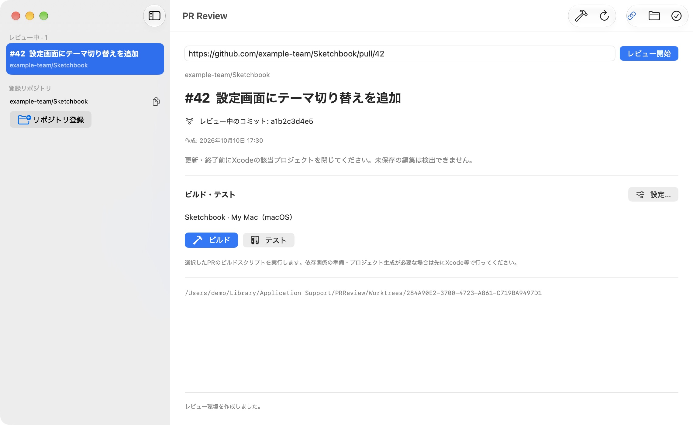

# PR Review

作業中のブランチを切り替えずに、別のPRをXcodeで開けるmacOSアプリです。

PRのURLを貼ると、レビュー用の作業フォルダ（Git worktree）を作ってXcodeで開きます。
追加コミットの取得やビルド・テスト、iOSアプリの起動もアプリから操作できます。レビューが終わったら、作業フォルダや専用Simulatorを片付けられます。



*画面のリポジトリとPRは架空のものです。*

## 起動する

現在はソースからビルドして使います。macOS 26以降、Xcode 26以降（Swift 6.2以降）、Git、GitHub CLIが必要です。
Xcodeは一度起動し、初期設定を済ませてください。

GitHub CLIをまだインストール・認証していない場合は、先に以下を実行します。Homebrewが必要です。

```sh
brew install gh
gh auth login
```

続いて、アプリをビルドして起動します。

```sh
git clone https://github.com/KantoYamamoto/pr-review.git
cd pr-review
./scripts/bundle.sh
open 'dist/PR Review.app'
```

Xcodeから起動する場合は `PRReview.xcodeproj` を開き、PRReview scheme / My Macを選んで ⌘R を押します。

## PRをレビューする

GitHub.comのPRに対応しています。レビューするリポジトリは手元にcloneし、`origin` をPRと同じリポジトリに向けておいてください。

1. **リポジトリを登録する。** 「リポジトリ登録」でローカルリポジトリを選びます。Xcodeプロジェクトは自動で検出します。複数見つかった場合は、開くものを選んでください。
2. **PRを開く。** `https://github.com/owner/repo/pull/123` を貼って「レビュー開始」を押すと、専用の作業フォルダを作ってXcodeで開きます。
3. **Xcodeで確認する。** 途中で閉じても、左のレビュー一覧から選び「Xcodeで開く」で再開できます。
4. **片付ける。** Xcodeで未保存の編集を保存してから該当プロジェクトを閉じ、アプリの「レビュー終了…」を押します。

PRに追加コミットが入ったら、Xcodeで未保存の編集を保存して該当プロジェクトを閉じ、「最新コミットを取得」を押してください。
レビュー用フォルダに変更したファイルなどが残っている場合は、更新・削除を止めて対象を表示します。
Xcodeの未保存の編集は検出できません。

### ビルド・テストする

レビュー画面の「設定…」でSchemeと実行先を選び、「ビルド」または「テスト」を押します。
設定は現在のレビューと、同じリポジトリから次に作るレビューに適用されます。実行後は画面からログやテスト結果を開けます。

iOSアプリは「Simulatorで起動」でビルドからインストール・起動まで進められます。
選択した端末と同じ機種・OSのレビュー専用Simulatorを作り、繰り返し使います。普段の開発用アプリやデータとは端末ごと分かれます。
Xcode 27では、開いたDevice Hubの一覧から画面に表示された専用端末を選んでください。
レビュー終了時に端末を残すか削除するか選べます。残した端末は「専用Simulatorの管理…」から削除できます。

ビルド・テストはmacOSとiOS Simulatorに対応し、テストは設定で選んだ実行先で動きます。
実機へのインストールには対応していません。
依存関係の準備やTuistなどによるプロジェクト生成が必要な場合は、先に手動で行ってください。
ビルド・テストではPR内のビルドスクリプトも実行されます。

### Firebaseなどの設定ファイルをコピーする

レビューに `GoogleService-Info.plist` やローカルの `.xcconfig` が必要な場合は、レビューを始める前に、
登録リポジトリの横にあるコピーボタンからファイルを指定します。
次にレビューを始めたとき、元のリポジトリから同じ相対パスへコピーします。既存のレビューには適用されません。

対象は、リポジトリ内でGit管理されておらず、`.gitignore` などで除外されたファイルです。フォルダはコピーできません。
コピーしたファイルを編集すると、レビューの更新・終了を止めます。必要な内容を元のリポジトリなどへ保存してから、
コピーを元の内容に戻すか削除してください。[コピーできるファイルの条件](docs/Usage.md#firebase設定ローカル設定をコピーする)

## 困ったとき

- **Gitの取得で認証エラーになる：** HTTPS接続なら `gh auth setup-git`、SSH接続ならSSH認証の設定を確認してください。
- **レビューを更新・終了できない：** 画面に表示されたファイルを確認し、必要な編集を保存してください。保護するファイルと削除できる条件は[動作と保護](docs/Usage.md#動作と保護)を参照してください。
- **状態を保存できない：** 環境や結果は保持されます。アプリを終了する前に保存先を確認し、「状態を再保存」を押してください。[保存先と環境の片付け方](docs/Usage.md#保存先)

アプリを削除する場合は、先に各レビューを終了し、「専用Simulatorの管理…」で残した端末も削除してください。アプリを削除してもレビュー用フォルダは残ります。

## 開発

[開発・確認](docs/Development.md)にプロジェクト構成とビルド・テスト手順、
[Architecture](docs/Architecture.md)にコードの責任分担と保存・復旧の流れを記載しています。
